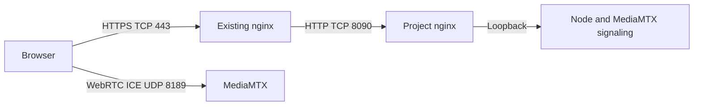

# HTTPS reverse proxy deployment

This guide exposes the application through an existing nginx installation that
already terminates HTTPS. The nginx instance bundled with this project remains
an internal upstream on port `8090`.

## Network flow



HTTPS reverse proxying covers the application, API, and WHEP signaling. WebRTC
media does not travel through the HTTP reverse proxy; clients connect directly
to MediaMTX on UDP port `8189`, with TCP `8189` available as a fallback.

## Choose a hostname or subpath

A dedicated hostname such as `printercam.example.com` is the simplest option.
The application can also be built for a subpath such as `/bambucam/`. The
configured path must end with `/`, and the external nginx must remove that
prefix before forwarding requests to the project nginx.

### Dedicated hostname

Create a DNS record for the hostname and add a dedicated HTTPS virtual host to
the existing nginx configuration. Reuse the installation's current certificate
and TLS policy:

```nginx
server {
    listen 443 ssl;
    server_name printercam.example.com;

    # Use the existing installation's certificate and TLS configuration.
    ssl_certificate     C:/path/to/fullchain.pem;
    ssl_certificate_key C:/path/to/privkey.pem;

    # Add the installation's existing access control here. This is mandatory
    # for Legacy mode, which has no application-level authentication.

    location / {
        proxy_pass http://127.0.0.1:8090;
        proxy_http_version 1.1;

        proxy_set_header Host $host;
        proxy_set_header X-Real-IP $remote_addr;
        proxy_set_header X-Forwarded-For $proxy_add_x_forwarded_for;
        proxy_set_header X-Forwarded-Proto https;

        proxy_buffering off;
        proxy_request_buffering off;
        proxy_read_timeout 3600s;
        proxy_send_timeout 3600s;
    }
}
```

Do not append a slash to `proxy_pass`; the complete request URI must reach the
project nginx unchanged. No WebSocket directives are required because playback
uses WHEP/WebRTC rather than WebSockets.

The old static `/hls` location can be removed after migration. This project no
longer generates or serves HLS files.

### Subpath

Configure the public base path before running setup so Vite builds asset, API,
and WebRTC URLs with the correct prefix:

```powershell
powershell.exe -NoProfile -ExecutionPolicy Bypass -File .\scripts\configure.ps1 -Mode Legacy -BasePath /bambucam/
powershell.exe -NoProfile -ExecutionPolicy Bypass -File .\scripts\setup.ps1 -BasePath /bambucam/
```

`config.local.psd1` overrides values from `config.psd1`. Do not set a conflicting
`BasePath` in the local file. Passing `-BasePath /bambucam/` to setup explicitly
overrides both files for that build. Setup prints the effective public base path
and verifies the generated asset prefix before reporting success.

For Multi mode, retain the required region and secure-cookie options:

```powershell
powershell.exe -NoProfile -ExecutionPolicy Bypass -File .\scripts\configure.ps1 -Mode Multi -Region eu -SecureCookies -BasePath /bambucam/
powershell.exe -NoProfile -ExecutionPolicy Bypass -File .\scripts\setup.ps1 -BasePath /bambucam/
```

Replace the old static `/hls` block with these locations in the existing HTTPS
server:

```nginx
location = /bambucam {
    return 308 /bambucam/;
}

location /bambucam/ {
    proxy_pass http://127.0.0.1:8090/;
    proxy_http_version 1.1;

    proxy_set_header Host $host;
    proxy_set_header X-Real-IP $remote_addr;
    proxy_set_header X-Forwarded-For $proxy_add_x_forwarded_for;
    proxy_set_header X-Forwarded-Proto https;

    proxy_redirect ~^/(.*)$ /bambucam/$1;
    proxy_buffering off;
    proxy_request_buffering off;
    proxy_read_timeout 3600s;
    proxy_send_timeout 3600s;
}
```

The trailing slash in both `location /bambucam/` and `proxy_pass ...:8090/` is
significant. It makes nginx forward `/bambucam/api/config` as `/api/config`.
`proxy_redirect` performs the inverse translation for WHEP session URLs
returned by MediaMTX.

After rebuilding and restarting, direct local access works at both
`http://127.0.0.1:8090/` and `http://127.0.0.1:8090/bambucam/`. The root page
loads the same subpath-aware build; its assets, API calls, and Legacy player
iframe continue below `/bambucam/`.

## Advertise the public WebRTC host

Add the externally resolvable hostname to both `mediamtx.yml` and
`mediamtx-studio.yml`:

```yaml
webrtcAdditionalHosts:
  - printercam.example.com
```

Restart the application after changing these files. The hostname becomes an ICE
candidate for the media connection; it does not change the HTTP listener.

## Firewall and NAT

Allow or forward only these public entry points:

| Protocol | Port | Destination | Purpose |
| --- | ---: | --- | --- |
| TCP | `443` | Existing nginx | HTTPS application and WHEP signaling |
| UDP | `8189` | MediaMTX host | Preferred WebRTC media transport |
| TCP | `8189` | MediaMTX host | Optional WebRTC fallback |

When nginx and this project run on the same machine, keep project port `8090`
restricted to that machine or the trusted LAN. When they run on different
machines, allow TCP `8090` only from the reverse proxy address.

Do not expose ports `8554`, `8787`, `8889`, or `9997`. They are internal RTSP,
backend, signaling, and control interfaces.

For a server behind a router, forward TCP `443` and UDP/TCP `8189` to the
corresponding hosts. For a cloud server, apply the equivalent rules in both the
Windows Firewall and the provider security group. If carrier-grade NAT or a
restrictive client network prevents direct ICE connectivity, deploy a TURN
server and configure `webrtcICEServers2` instead of exposing additional internal
services.

## Multi-mode cookies

Multi mode must use secure cookies when the public URL is HTTPS. Run the
configuration command with the account's actual region:

```powershell
powershell.exe -NoProfile -ExecutionPolicy Bypass -File .\scripts\configure.ps1 -Mode Multi -Region eu -SecureCookies
```

Then restart the application. Do not enable secure cookies while accessing the
application directly over plain HTTP because browsers will not send them.

## Validate the deployment

Validate and reload the existing nginx installation using its normal service
procedure. From a client outside the server, check:

```powershell
Invoke-WebRequest https://printercam.example.com/health
# Subpath deployment:
Invoke-WebRequest https://srv-wis.dscsag.net/bambucam/health
```

A healthy HTTP path returns status `200` and body `ok`. Then open the configured
public URL and start a camera. If the page and API load
but video remains on `Connecting`, verify UDP `8189`, the router or cloud
firewall, and `webrtcAdditionalHosts`. If the page itself fails, inspect the
existing nginx error log and verify that the project reports `running` through
`status_streaming.bat`.

After confirming HTTPS access, use only the public hostname in the browser so
Multi-mode secure session cookies behave consistently.
